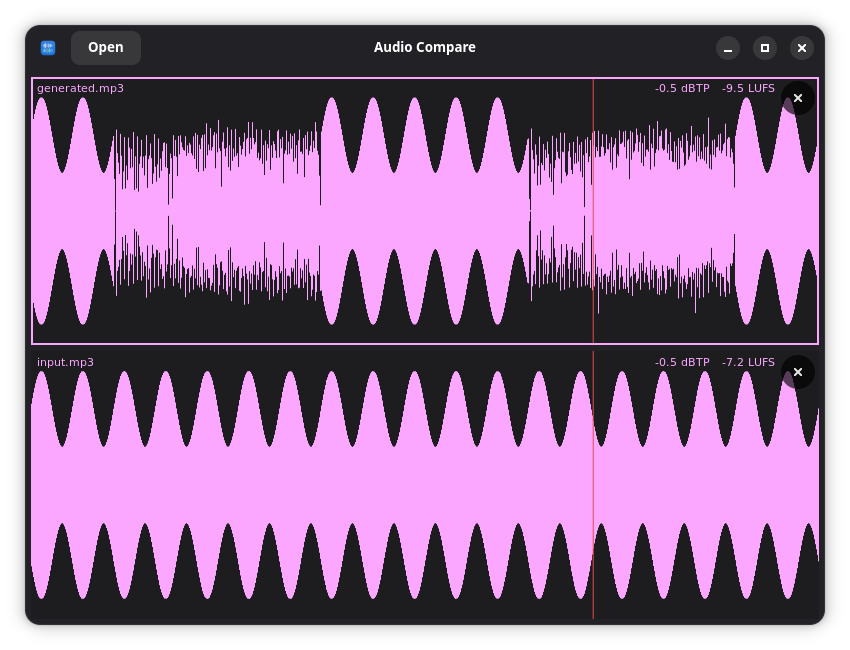

<p align="center"></p>

# audio-compare

Compare two or more audio files by ear on GNOME.

Load some files, see their waveforms stacked, and A/B them at the same playback position — switch which one you hear without losing your place.



## Features

- Open `mp3`, `wav`, `ogg` files (mono or stereo) via the Open button or drag-and-drop.
- One waveform pane per file, following the light/dark scheme and system accent colour.
- Switching keeps the playback position, so you always compare the same moment.
- Playback loops from the start on end.
- Each pane shows integrated loudness (LUFS) and max true peak (dBTP).

| Shortcut | Action |
|---|---|
| `Space` | Play / pause |
| `Alt+↑` / `Alt+↓` | Switch to the file above / below (keeps position) |
| Click a pane | Make it active and seek to that point |
| Click + drag | Scrub |

## Install

**Nix**
```sh
nix run github:mmxgn/audio-compare
```

**AppImage** — grab the latest from the [releases page](https://github.com/mmxgn/audio-compare/releases/latest).
```sh
chmod +x audio-compare-*.AppImage && ./audio-compare-*.AppImage
```

## Develop

```sh
nix develop
meson setup build && ninja -C build && ./build/audio-compare
```

## Requirements

GTK 4 · libadwaita · GStreamer · libebur128
